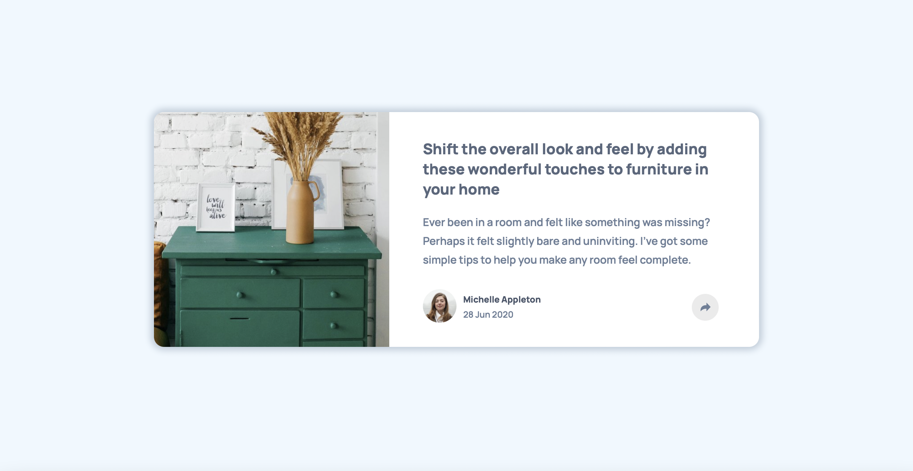

# Frontend Mentor - Article preview component solution

This is a solution to the [Article preview component challenge on Frontend Mentor](https://www.frontendmentor.io/challenges/article-preview-component-dYBN_pYFT). Frontend Mentor challenges help you improve your coding skills by building realistic projects. 

## Overview

### The challenge

Users should be able to:

- View the optimal layout for the component depending on their device's screen size
- See the social media share links when they click the share icon

### Screenshot

### Links

- Live Site URL: (https://jvmcpheron.github.io/article-preview/)

## My process

### Built with

- Semantic HTML5 markup
- CSS
- JavaScript
- Flexbox
- CSS
- Mobile-first workflow

### What I learned

I learned a little more about absolute positioning in css and how to use it. I also learned about display: none, and how to take advantage of it to make things appear when a button is clicked using JavaScript.

## Author

- Website - [Jane](https://jvmcpheron.github.io/Bootstrap_Portfolio)
- Frontend Mentor - [@jvmcpheron](https://www.frontendmentor.io/profile/jvmcpheron)
- Github - [@jvmcpheron](https://github.com/jvmcpheron)

## Acknowledgments

Worked on this with a friend of mine named Hunter. His Github: https://github.com/HunterMcGrew 